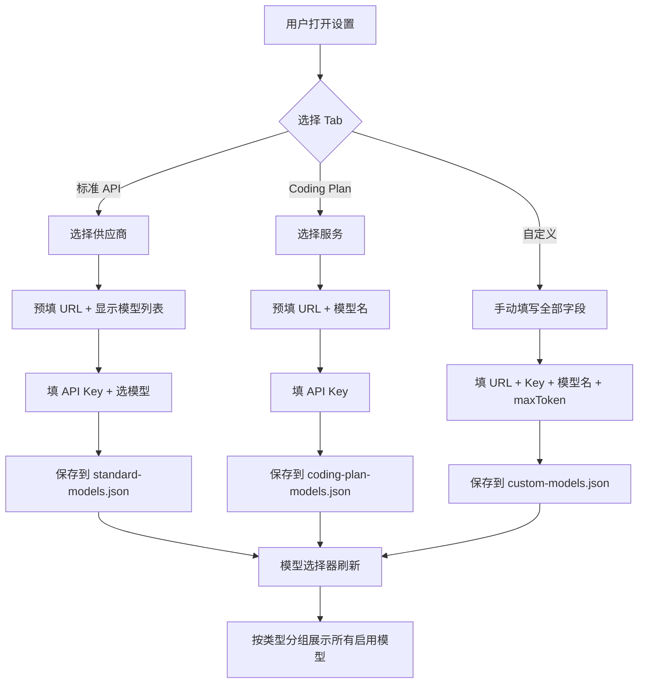
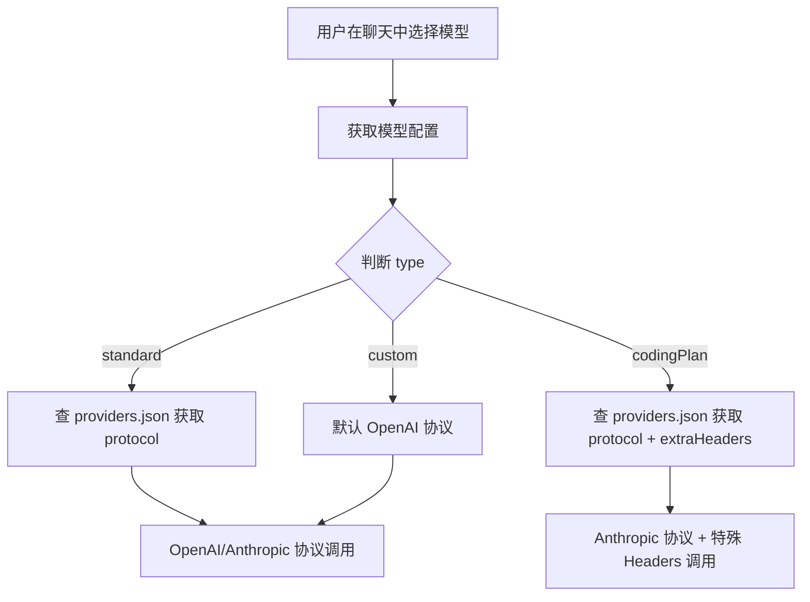

# Master Plan: 模型类型系统

## 概述与目标

当前项目的模型设置仅支持一种统一的手动配置方式（填写 URL、Key、模型名等），对于常见供应商（如 OpenAI）缺少快捷配置，对于特殊协议的服务（如 Kimi Coding Plan）也无法适配。

本次改造将模型配置系统升级为**三种类型**，在保持向后兼容的前提下，降低常见供应商的配置门槛，并为特殊协议服务提供独立的集成路径。

### 三种模型类型

| 类型 | 英文标识 | 典型场景 | 配置方式 |
|------|---------|---------|---------|
| 标准 API | `standard` | OpenAI、Anthropic、Gemini、DeepSeek | 选供应商 → 填 Key → 选模型 |
| Coding Plan | `codingPlan` | Kimi K2.5 Coding Plan | 选服务 → 填 Key |
| 自定义 | `custom` | 任何 OpenAI 兼容 API、私有部署等 | 手动填写全部字段（现有方式） |

## 范围定义

### 包含

1. **新增标准 API 类型** — 预置 4 家供应商（OpenAI、Anthropic、Google Gemini、DeepSeek），用户选择后预填 API URL，从模型列表下拉选择，填入 Key 即可使用
2. **新增 Coding Plan 类型** — 首期仅支持 Kimi K2.5，使用 Anthropic Messages API 协议 + 特殊 Headers 调用
3. **保留自定义类型** — 现有配置方式不变，作为兜底方案
4. **前端 UI 改造** — 设置面板改为三 Tab 标签页，分别管理三种类型
5. **后端存储重构** — 拆分为三个独立 JSON 文件
6. **数据迁移** — 现有配置自动迁移为自定义类型
7. **后端调用适配** — 根据模型类型选择正确的 API 调用协议
8. **模型选择器改造** — 聊天界面模型下拉按类型分组显示

### 不包含

- 供应商在线模型列表自动拉取（API 验证后自动发现可用模型）
- 模型分组/收藏/标签功能
- 远程供应商模板更新机制
- 新增供应商的 UI 自助添加（标准 API 供应商列表通过后端配置文件管理）

## 高层架构

### 数据模型

```
三种类型共享基础字段，各自扩展特有字段：

BaseModelConfig
├── id: string
├── name: string (显示名称)
├── isDefault: boolean
├── isEnabled: boolean
├── createdAt: string
└── updatedAt: string

StandardModelConfig extends BaseModelConfig
├── type: "standard"
├── providerId: string (关联到供应商模板)
├── apiUrl: string (预填，可修改)
├── apiKey: string
└── modelName: string (从供应商模型列表选择)

CodingPlanModelConfig extends BaseModelConfig
├── type: "codingPlan"
├── serviceId: string (如 "kimi")
├── apiKey: string
└── (其余配置由 serviceId 关联的模板决定)

CustomModelConfig extends BaseModelConfig
├── type: "custom"
├── apiUrl: string
├── apiKey: string
├── modelName: string
└── maxToken?: number
```

### 存储结构

```
backend/userData/
├── standard-models.json       # 标准 API 类型配置
├── coding-plan-models.json    # Coding Plan 类型配置
└── custom-models.json         # 自定义类型配置 (从 model-configs.json 迁移)

backend/config/
└── providers.json             # 供应商预置模板 (只读)
```

### 供应商模板 (providers.json)

```
{
  "standard": [
    {
      "id": "openai",
      "name": "OpenAI",
      "apiUrl": "https://api.openai.com/v1",
      "models": ["gpt-4o", "gpt-4o-mini", "gpt-4-turbo", "gpt-3.5-turbo", "o1", "o1-mini"],
      "protocol": "openai"
    },
    {
      "id": "anthropic",
      "name": "Anthropic",
      "apiUrl": "https://api.anthropic.com",
      "models": ["claude-sonnet-4-20250514", "claude-haiku-4-20250414", "claude-3-5-sonnet-20241022"],
      "protocol": "anthropic"
    },
    {
      "id": "gemini",
      "name": "Google Gemini",
      "apiUrl": "https://generativelanguage.googleapis.com/v1beta/openai",
      "models": ["gemini-2.5-flash", "gemini-2.5-pro", "gemini-2.0-flash"],
      "protocol": "openai"
    },
    {
      "id": "deepseek",
      "name": "DeepSeek",
      "apiUrl": "https://api.deepseek.com",
      "models": ["deepseek-chat", "deepseek-reasoner"],
      "protocol": "openai"
    }
  ],
  "codingPlan": [
    {
      "id": "kimi",
      "name": "Kimi Coding Plan",
      "apiUrl": "https://api.kimi.com/coding",
      "model": "kimi-k2.5",
      "protocol": "anthropic",
      "extraHeaders": {
        "anthropic-version": "2023-06-01",
        "User-Agent": "claude-code/1.0"
      },
      "defaultParams": {
        "temperature": 1.0,
        "top_p": 0.95
      }
    }
  ]
}
```

### 系统流程





## 关键设计决策

### 1. 三文件存储 vs 单文件存储

**选择三文件** — 每种类型独立文件，避免单文件过大或结构过深。迁移时只需将现有 `model-configs.json` 重命名/移动为 `custom-models.json`。

### 2. 供应商模板放后端 vs 前端

**选择后端** — `providers.json` 作为后端只读配置，前端通过 API 获取。这样 Electron 打包后也能更新模板（修改文件即可），无需重新编译前端。

### 3. 标准 API 的 URL 完全可编辑

允许用户修改预填 URL（例如使用代理地址或企业私有端点），URL 作为预填值而非锁定值。

### 4. Coding Plan 协议适配

Kimi 使用 Anthropic Messages API 格式但有特殊 Headers 要求。通过 `providers.json` 中的 `extraHeaders` 字段描述，后端调用时自动注入，无需硬编码。

### 5. 一个供应商多个模型

标准 API 类型中，同一供应商可以添加多条配置（不同模型），每条是独立的 `StandardModelConfig` 记录。共享供应商的 URL 和 Key 不做自动关联，保持简洁。

### 6. 模型选择器完全透明

聊天界面的模型下拉菜单按类型分组显示，但用户操作方式统一 — 选中即用。不同类型的协议差异完全由后端处理。

### 7. 向后兼容迁移

启动时检测旧 `model-configs.json` 文件，若存在且新文件不存在，自动将所有模型标记为 `custom` 类型并写入 `custom-models.json`，然后备份旧文件。

## 依赖与假设

### 依赖

- 现有的前后端通信架构（Next.js API → Flask）不变
- TipTap 编辑器和 Agent 系统不受影响（只消费模型配置）
- 后端 `ConfigLoader` 类需要扩展，支持多文件加载

### 假设

- 标准 API 供应商均兼容 OpenAI Chat Completions 格式（除 Anthropic 外）
- Anthropic 有自己的 Messages API 格式，需要单独的调用逻辑
- Kimi Coding Plan 的 API 行为稳定，`User-Agent` 检查策略不会频繁变更
- 用户一般不会有超过 20 个模型配置（性能无需特别优化）

## 风险评估

| 风险 | 影响 | 缓解措施 |
|------|------|---------|
| Kimi API 协议变更 | Coding Plan 调用失败 | 协议参数外置到 providers.json，无需改代码 |
| 迁移过程数据丢失 | 用户需重新配置 | 迁移前备份原文件，迁移逻辑简单（仅加 type 字段） |
| 供应商模型列表过时 | 用户找不到新模型 | 模型名字段可手动输入（下拉 + 输入混合模式） |
| 三文件同步问题 | defaultModelId 跨文件不一致 | 设计统一的 getDefaultModel 逻辑，跨三文件查找 |
| Anthropic 协议适配复杂度 | 标准 API 中 Anthropic 调用失败 | Anthropic 的 protocol 标记为 "anthropic"，后端已有对应调用逻辑 |

## 规划文档目录

| 编号 | 文件名 | 内容 |
|------|-------|------|
| 01 | `specs/01-data-model-and-storage.md` | 数据模型、TypeScript 接口、JSON 存储结构、迁移策略 |
| 02 | `specs/02-backend-api-and-protocol.md` | 后端 API 路由、供应商模板加载、协议适配层 |
| 03 | `specs/03-frontend-settings-ui.md` | 三 Tab 设置面板 UI、表单交互、供应商选择流程 |
| 04 | `specs/04-model-selector-integration.md` | 聊天界面模型选择器改造、分组显示、类型透明调用 |__
