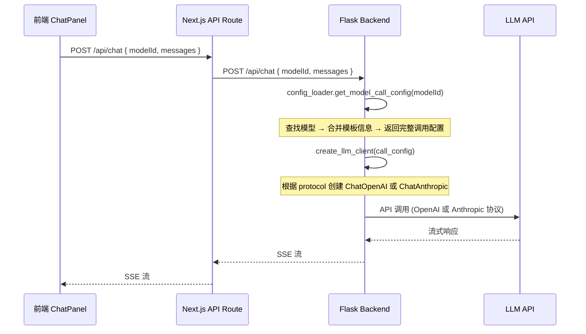

# Spec 04: 模型选择器与调用集成

## 概述

改造聊天界面的模型选择器组件，使其能够按类型分组显示所有启用的模型，并确保选择任意类型的模型后，后端能正确使用对应协议完成调用。

## 1. 模型选择器 UI 改造

### 当前状态

`ChatPanel.tsx` 中的模型选择器是一个简单的下拉列表，显示所有启用的模型，用户选择后将 `modelId` 传给后端。

### 改造后的分组下拉

```
┌──────────────────────────┐
│ ▼ 选择模型                │
├──────────────────────────┤
│ ── 标准 API ──           │
│   ⭐ GPT-4o              │
│      Claude Sonnet 4     │
│      Gemini 2.5 Flash    │
│ ── Coding Plan ──        │
│      Kimi K2.5           │
│ ── 自定义 ──              │
│      Qwen Max            │
│      本地 Ollama          │
└──────────────────────────┘
```

### 分组规则

1. 三个分组: "标准 API" / "Coding Plan" / "自定义"
2. 分组标题作为不可选的分隔行
3. 每组内按添加时间排序
4. 默认模型显示星标 ⭐
5. 空分组不显示（如果没有 Coding Plan 模型，该分组标题也隐藏）
6. 分组名称国际化

### 选择行为

- 用户选择模型后，行为与现在完全相同 — 将 `modelId` 传给后端
- 模型类型对用户完全透明，不影响操作方式
- 选中的模型显示在下拉收起后的文本中（仅显示名称，不显示类型）

## 2. 数据加载

### ChatPanel 改造

```pseudo
// 现有逻辑
const configList = await loadModelConfigs()
const enabledModels = configList.models.filter(m => m.isEnabled !== false)

// 改造后
const configList = await loadAllModelConfigs()
const enabledModels = configList.models.filter(m => m.isEnabled !== false)

// 按类型分组
const groupedModels = {
  standard: enabledModels.filter(m => m.type === "standard"),
  codingPlan: enabledModels.filter(m => m.type === "codingPlan"),
  custom: enabledModels.filter(m => m.type === "custom")
}
```

### 模型配置变更监听

现有的 `docaimaster_model_configs_updated` 事件继续使用。当设置面板保存任意类型的配置时，触发此事件，ChatPanel 重新加载全部模型。

## 3. 后端调用链路

### 完整调用流程



### 关键改动点

**chat 域 (`backend/domains/chat/`)**

```pseudo
// 现有
model_config = config_loader.get_llm_config(model_id)
llm = ChatOpenAI(
    api_key=model_config["apiKey"],
    base_url=model_config["apiUrl"],
    model=model_config["modelName"]
)

// 改造后
call_config = config_loader.get_model_call_config(model_id)
llm = create_llm_client(call_config)
```

**agent 域 (`backend/domains/agent/` 及 `backend/agent/`)**

同样的改造。AutoWriterAgent 和 DocumentModifierAgent 中创建 LLM 客户端的位置都需要使用 `create_llm_client`。

### create_llm_client 实现位置

建议放在 `backend/llm_factory.py` 或 `backend/utils/llm_factory.py`:

```pseudo
FUNCTION create_llm_client(call_config):
  protocol = call_config["protocol"]

  IF protocol == "openai":
    return ChatOpenAI(
      api_key = call_config["apiKey"],
      base_url = call_config["apiUrl"],
      model = call_config["modelName"],
      max_tokens = call_config.get("maxToken"),
      streaming = True
    )

  ELSE IF protocol == "anthropic":
    kwargs = {}
    IF call_config.get("defaultParams"):
      kwargs.update(call_config["defaultParams"])

    return ChatAnthropic(
      api_key = call_config["apiKey"],
      base_url = call_config["apiUrl"],
      model = call_config["modelName"],
      default_headers = call_config.get("extraHeaders", {}),
      streaming = True,
      **kwargs
    )

  ELSE:
    # 未知协议，回退 OpenAI
    logger.warning(f"Unknown protocol: {protocol}, falling back to OpenAI")
    return ChatOpenAI(...)
```

## 4. 流式响应适配

### 问题

当前 chat 服务的流式处理假设 OpenAI SSE 格式。Anthropic 协议的 SSE 事件格式不同:

- **OpenAI**: `data: {"choices": [{"delta": {"content": "..."}}]}`
- **Anthropic**: `data: {"type": "content_block_delta", "delta": {"type": "text_delta", "text": "..."}}`

### 解决方案

LangChain 的 `astream_events()` 方法已经将两种协议的流式输出统一为一致的事件格式。只要使用 LangChain 的流式 API（项目已在使用），无需额外适配。

验证点:
- `ChatAnthropic` + `astream_events()` 产生的事件与 `ChatOpenAI` + `astream_events()` 格式一致
- 前端 SSE 处理代码无需修改

## 5. Chatbot 模型关联

### 问题

Chatbot 功能允许为聊天机器人指定固定模型 (`modelId`)。新的类型系统不影响此机制 — `modelId` 仍然是唯一标识，后端通过 ID 跨三文件查找。

### 兼容性

- 已关联的 `modelId` 可能在迁移后位于 `custom-models.json` 中
- 只要 ID 不变，关联关系不受影响
- 若关联的模型被删除，现有的回退逻辑（使用默认模型）继续生效

## 6. 模型配置同步

### Cookie 同步改造

`modelConfigSync.ts` 的 `syncModelConfigsToCookies` 函数需要修改:

```pseudo
FUNCTION syncModelConfigsToCookies():
  // 从三个 localStorage 键合并
  const standard = localStorage.get("docaimaster_standard_models")
  const codingPlan = localStorage.get("docaimaster_coding_plan_models")
  const custom = localStorage.get("docaimaster_custom_models")

  const merged = {
    models: [...standard.models, ...codingPlan.models, ...custom.models],
    defaultModelId: standard.defaultModelId || codingPlan.defaultModelId || custom.defaultModelId
  }

  setCookie("docaimaster_model_configs", JSON.stringify(merged))
```

### getDefaultModelServer 改造

Next.js API 路由中的 `getDefaultModelServer` 继续从合并后的 Cookie 数据中查找默认模型，逻辑不变。

## 7. 边界情况

### 无模型配置

三个文件都为空时，显示引导界面: "请先在设置中添加模型配置"。

### 所有模型被禁用

与现有行为一致 — 模型选择器显示为空，发送消息时提示 "请先启用至少一个模型"。

### Coding Plan 调用失败

Kimi API 返回 403（User-Agent 不匹配等）时:
- 后端捕获异常，返回结构化错误消息
- 前端显示 "调用失败: Kimi Coding Plan 服务返回错误 (403)"
- 不影响其他模型的使用
